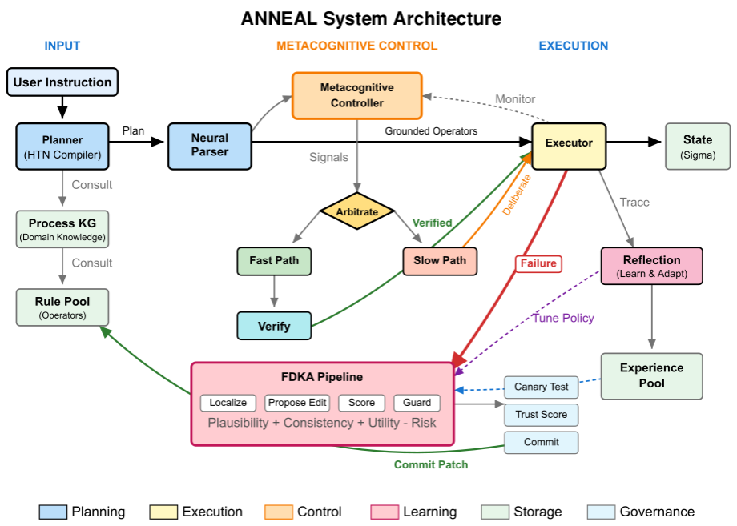

# ANNEAL: Adapting LLM Agents via Governed Symbolic Patch Learning

[](https://www.python.org/downloads/)
[](LICENSE)
[](https://arxiv.org/abs/2605.16309)

> LLM-based agents recover from individual errors but repeatedly fail on the same fault when process knowledge remains unrepaired. **ANNEAL** converts recurring failures into governed symbolic edits of a process knowledge graph — without modifying foundation model weights.

<p align="center">
  
</p>

## Key Results

Evaluated with GPT-4o-mini across 27 multi-seed runs (3 agents, 3 scenarios, 3 seeds each):

| Domain | ANNEAL | ReAct | Reflexion | Patches |
|--------|--------|-------|-----------|---------|
| Travel planning | 100.0±0.0% | 100.0±0.0% | 100.0±0.0% | 1.0±0.0 |
| Travel stochastic | 100.0±0.0% | 97.3±2.3% | 100.0±0.0% | 1.0±0.0 |
| E-commerce | 94.7±2.3% | 78.7±2.3% | **98.7±1.9%** | 2.7±0.6 |
| ITSM (untuned transfer) | 100.0±0.0% | — | — | 1.0±0.0 |

ANNEAL is the only system that commits persistent structural repairs. In recurring-failure stress tests, committed patches suppress holdout failures to **0%**, while ReAct and Reflexion retain 72–100% holdout failure rates despite high episodic SR.

## Quick Start

```bash
# Set up environment
conda activate hysym
export OPENAI_API_KEY="sk-..."

# Single evaluation run (default: e-commerce, 25 tasks)
python main.py --config config.yaml --mode eval

# Multi-seed reproducibility matrix (paper Tables 2–4)
python scripts/run_agent_matrix.py \
  --base-config config.yaml \
  --agents anneal react reflexion \
  --scenarios travel_planning ecommerce travel_stochastic \
  --seeds 7 13 31 --mode eval

# Aggregate results
python scripts/summarize_multiseed_metrics.py data/output_dir
```

All four domains (travel, e-commerce, travel stochastic, ITSM) are switchable inside `config.yaml`.

### Cross-model spot-check (optional)

FDKA's patch synthesizer is provider-agnostic. To rerun the e-commerce matrix with Anthropic's Claude family in place of GPT-4o-mini, set `ANTHROPIC_API_KEY` and switch the provider under `fdka.propose_edit` in `config.yaml`:

```yaml
fdka:
  propose_edit:
    llm_provider: "anthropic"
    model: "claude-haiku-4-5-20251001"
```

Then run the same `scripts/run_agent_matrix.py` invocation. The symbolic acceptance layer (scoring, guardrails, canary) is unchanged.

## Project Structure

```
├── main.py                          # Entry point
├── config.yaml                      # Unified configuration (all domains & providers)
├── src/
│   ├── constants.py                 # System name (single source of truth)
│   ├── core/
│   │   ├── system.py                # Main orchestrator
│   │   ├── planner.py               # HTN planner
│   │   └── executor.py              # Operator execution + verify/repair
│   ├── fdka/
│   │   ├── failure_classifier.py    # Patchability classification
│   │   ├── propose_edit.py          # Constrained patch synthesis (3-stage)
│   │   ├── scoring.py               # Multi-dimensional scoring
│   │   └── llm_providers/           # OpenAI, DeepSeek, Anthropic, mock backends
│   ├── governance/
│   │   ├── guard.py                 # Value/causal guardrails
│   │   ├── canary.py                # Canary testing
│   │   ├── trust.py                 # Beta-Bernoulli trust scoring
│   │   └── provenance.py            # Provenance tracking + rollback sets
│   ├── metacognition/
│   │   ├── arbitrator.py            # S1/S2/Verify pathway selection
│   │   ├── signals.py               # Uncertainty + violation signals
│   │   └── reflection.py            # Threshold tuning
│   ├── knowledge/
│   │   ├── rule_pool.py             # Operator definitions + committed patches
│   │   ├── experience_pool.py       # Indexed failure traces
│   │   └── value_kg.py              # Deontic constraint knowledge graph
│   ├── scenarios/                   # Travel, e-commerce, ITSM, stochastic
│   └── baselines/                   # ReAct, Reflexion, LLM-Reflect, Static-NS
├── scripts/
│   ├── run_agent_matrix.py          # Multi-seed evaluation runner
│   ├── summarize_multiseed_metrics.py
│   └── run_ecommerce_stress.py      # Recurring-failure stress (PlaceOrder schema drift)
├── analysis/                        # Post-hoc evaluation tooling
│   ├── recovery_source_breakdown.py # Verify-vs-FDKA attribution per task
│   ├── significance_analysis.py     # Bootstrap CIs + paired tests
│   └── governance_breadth_probe.py  # Unsafe-edit guard coverage probe
├── tests/                           # Unit and integration tests
└── data/knowledge/extracted/        # Domain knowledge graphs (input)
```

## Ablation Summary

| Ablation | Domain | Delta SR | Interpretation |
|----------|--------|----------|----------------|
| −FDKA | E-commerce | −26.7pp | Eliminates all structural repairs |
| −Arbitration | Travel stochastic | −4.7pp | Compound policy shifts overwhelm fast path |
| −Verify | E-commerce | +4.0pp | Residual constraint types |
| −Governance | Routine benchmark | 0.0pp | Low-risk patches pass silently |
| −Governance | Stress suite | 6/6 escalated | Auth-sensitive edits selectively blocked |

## Citation

```bibtex
@misc{hakim2026anneal,
  title={{ANNEAL}: Adapting LLM Agents via Governed Symbolic Patch Learning},
  author={Hakim, Safayat Bin and Guo, Keyan and Tan, Wenkai and Velasquez, Alvaro and Xu, Shouhuai and Song, Houbing Herbert},
  year={2026},
  eprint={2605.16309},
  archivePrefix={arXiv},
  primaryClass={cs.AI},
  url={https://arxiv.org/abs/2605.16309}
}
```

## Contact

For questions or comments about this work, feel free to reach out:

> **safayat** &#x200B;[dot]&#x200B; **b** &#x200B;[dot]&#x200B; **hakim** &#x200B;[at]&#x200B; **gmail** &#x200B;[dot]&#x200B; **com**

(Replace `[at]` with `@` and `[dot]` with `.` to get the address.)

## License

MIT License.
